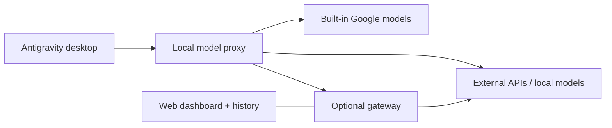

<p align="center">
  
</p>

<h1 align="center">Antigravity Custom Model Enabler</h1>

<p align="center">
  <strong>Your providers. Your local models. Inside Antigravity.</strong><br>
  Model management for the standalone desktop app, with an optional gateway and web dashboard.
</p>

<p align="center">
  <a href="README.md"><strong>🇮🇷 راهنمای فارسی (Persian Documentation)</strong></a> ·
  <a href="#installation"><strong>Quick start</strong></a> ·
  <a href="#quick-links">Quick links</a> ·
  <a href="#screenshots">Screenshots</a> ·
  <a href="#documentation">Documentation</a>
</p>

---

Add external API providers and local models alongside Antigravity's built-in models. Configure them in Settings, switch models from the chat picker, and optionally route requests through a gateway with history, fallback providers, and a browser dashboard.

> [!IMPORTANT]
> This project targets the **standalone Electron desktop agent**. The separate **VS Code-based Antigravity IDE is not supported**. Custom-model routing applies to local desktop sessions; the vendor's WSL routing is preserved. Check [compatibility](docs/compatibility.md) before installing.

## Quick links

| Get started | Configure and connect | Help and project |
| --- | --- | --- |
| [Installation](#installation) | [Gateway and web dashboard](#optional-gateway-and-web-dashboard) | [Troubleshooting and recovery](#updates-diagnostics-and-recovery) |
| [Add your first model](#add-your-first-model) | [Connect from another computer](#connect-from-another-computer) | [Supported app versions and layouts](docs/compatibility.md) |
| [Providers and model catalogs](docs/providers.md) | [Model configuration](docs/configuration.md) | [Changelog](CHANGELOG.md) |
| [Development and contributing](#development-and-contributing) | [Google account setup](docs/configuration.md#google-cloud-code-account-pools) | [Browse existing issues](https://github.com/vahapogut/antigravity-add-model/issues) |

## What you can do

| Capability | Included |
| --- | --- |
| **Manage models** | Provider groups, search, edit, duplicate, enable/disable, and model discovery. |
| **Connect your providers** | OpenAI, Anthropic, Gemini, OpenRouter, and other compatible APIs; local services such as Ollama, LM Studio, and vLLM. |
| **Tune requests** | Protocol selection, reasoning settings, context/output limits, custom headers, timeouts, retries, fallbacks, and circuit breakers. |
| **Use Google account pools** | Explicit OAuth sign-in with your own client, encrypted account storage, token refresh, quota checks, and account selection. |
| **Share configuration** | Validated JSON/base64 import and exports that omit stored credentials. |
| **Add a web dashboard** | Optional gateway with provider routing, request/session history, replay, charts, and cost estimates. |
| **Connect remotely** | Authenticated gateway access through a tunnel or a configured network endpoint. |

The installer preserves the installed application's runtime and adds validated hooks. It keeps version-specific backups and rolls back failed deployments. See the [feature comparison](docs/feature-parity.md) for implementation details and scope.

## Screenshots

### Model management

Search your models, organize them by provider, and edit, duplicate, or enable connections from one place.

<p align="center">
  <a href="assets/model_manager.jpg"></a>
</p>

*Current addon controls rendered in an isolated browser demo with illustrative model settings. Click an image to view it at full size.*

### Model editor

Configure a provider and model, choose an API format, or discover available models.

<p align="center">
  <a href="assets/model_editor.jpg"></a>
</p>

### Remote gateway

Save a gateway connection, import model aliases, and open its management dashboard.

<p align="center">
  <a href="assets/remote_gateway.jpg"></a>
</p>

### Gateway dashboard

Map model aliases to providers and configure fallback models and context limits in the optional web panel.

<p align="center">
  <a href="assets/model_gateway.jpg"></a>
</p>

*Current gateway interface in a local test profile; the displayed model mapping is illustrative.*

<details>
<summary><strong>Desktop chat picker — earlier build</strong></summary>

<p align="center">
  
</p>

*Example from an earlier desktop build. Model names and availability depend on your provider and configuration.*

</details>

## Installation

### 1. Get the project and build

You need the **standalone Antigravity desktop app**, Git, and **Node.js 22.13 or newer**. This Node version covers both the desktop addon and the optional gateway.

```sh
git clone https://github.com/vahapogut/antigravity-add-model.git
cd antigravity-add-model
npm ci --ignore-scripts
npm run build
```

Already have the repository? Update your checkout, then run the dependency and build commands again.

### 2. Check and patch the installed app

Close Antigravity and its language server first. From the repository directory, run:

```sh
node scripts/deploy.mjs --check
node scripts/deploy.mjs
```

The first command checks compatibility without changing the installation. The second applies the addon. Reopen Antigravity after a successful deployment.

If automatic detection cannot find your app, use the same explicit path for both commands:

```sh
node scripts/deploy.mjs --check --resources "/path/to/Antigravity/resources"
node scripts/deploy.mjs --resources "/path/to/Antigravity/resources"
```

`--resources` accepts a Resources directory, an installation directory, or a macOS `.app` directory. Unknown layouts are rejected before application files are replaced.

<details>
<summary><strong>Platform wrappers and the optional Windows endpoint patch</strong></summary>

The wrappers call the same installer and accept the same arguments.

| Platform | Wrapper |
| --- | --- |
| Windows / PowerShell | `./deploy.ps1` |
| macOS standalone app | `bash deploy.sh` |
| Linux | `bash deploy_linux.sh` |

Some recognized Windows language-server binaries bypass the configurable model-list endpoint. For those builds, check and apply the optional binary patch:

```powershell
.\deploy.ps1 --check --patch-language-server
.\deploy.ps1 --patch-language-server
```

This option requires port **50999** and participates in backup/rollback. It is specific to recognized Windows binaries. See [Windows endpoint patching](docs/compatibility.md#optional-windows-language-server-endpoint-patch).

</details>

## Add your first model

1. Open **Settings → Models & Usage** (**Models** in older layouts).
2. In **Custom Models**, select **Add model** and choose a provider.
3. Enter the **API URL** and **API key** when required.
4. Add models using either of the options below, then select a saved model from the chat picker.

| Method | Steps |
| --- | --- |
| **Enter a model manually** | Enter the exact **Provider model ID**, optionally set a display name, then choose **Test connection → Save model**. |
| **Choose from the provider catalog** | Choose **Fetch provider models**, search by name or ID, check models or **Select filtered**, then **Add selected**. |

**Running models locally?** Start your local server first, then choose **Discover local**. Discovery checks common ports only when requested.

**Moving settings between machines?** Use **Export** and **Import**. Exported configurations omit API keys, custom headers, and Google tokens/client secrets; enter credentials on the receiving machine.

> [!NOTE]
> A successful connection test verifies model listing and authentication. It does not generate a completion or prove that an account has generation quota. Providers without a listing endpoint can still be configured manually.

### Providers and advanced options

| Connection | Examples available in the preset catalog |
| --- | --- |
| Multi-model services | OpenRouter, Together AI, Hugging Face Inference Providers, Fireworks AI, SiliconFlow, Novita AI |
| Direct hosted APIs | OpenAI, Anthropic, Google Gemini, DeepSeek, Groq, Mistral, xAI, Cerebras, SambaNova, Alibaba Cloud Model Studio, NVIDIA NIM |
| Local servers | Ollama, LM Studio, llama.cpp, vLLM, LocalAI, TabbyAPI, Text Generation WebUI |
| Other endpoints | LiteLLM, compatible custom endpoints, or an authenticated model gateway |

Presets fill in defaults; **API format** determines how requests are translated. Model IDs and access depend on the provider. The [provider catalog](src/providers.ts) is the full list.

**Want hundreds of model choices?** OpenRouter and other multi-model services supply live catalogs through **Fetch provider models**. Search and select the models you need; the addon imports available context/output limits and image/reasoning metadata while preserving your explicit overrides. Catalogs change over time, and a listed model still needs account access and the capabilities your task requires. See [provider setup and model discovery](docs/providers.md).

Open **Advanced settings** for request limits, reasoning, headers, fallback models, and other overrides. See the [configuration reference](docs/configuration.md) for field definitions and a sample import.

For Google account pooling, choose **Google Cloud Code account pool** and follow the [account setup guide](docs/configuration.md#google-cloud-code-account-pools). You supply your own Desktop OAuth client; account and service eligibility remain provider-controlled.

## Optional gateway and web dashboard

The desktop addon can connect directly to your providers. Add the gateway when you want centralized routing, browser management, request history, or a remote endpoint.

```sh
npm run gateway:install
npm run gateway:build
npm run gateway -- setup --non-interactive
npm run gateway -- start
```

Setup prints the generated gateway token and dashboard login locally. Open **http://127.0.0.1:51001**, sign in, configure provider credentials and model aliases, then save.

In the desktop's **Remote gateway** dialog, enter:

| Field | Local setup |
| --- | --- |
| Gateway URL | `http://127.0.0.1:51000` |
| Gateway token | The token printed by setup |
| Dashboard URL | `http://127.0.0.1:51001` |

Choose **Test gateway**, then **Import model aliases**. The imported models appear in the desktop picker. **Open dashboard** opens the saved dashboard URL.

<details>
<summary><strong>Gateway commands</strong></summary>

```sh
npm run gateway -- status
npm run gateway -- logs
npm run gateway -- stop
```

Provider/model changes saved in the dashboard reload immediately. Listening address and port changes require a restart. History includes prompts, responses, and tool arguments; cost totals are estimates.

</details>

### Connect from another computer

Run the gateway on the host with access to your providers. On the client, forward both ports over SSH:

```sh
ssh -N -L 51000:127.0.0.1:51000 -L 51001:127.0.0.1:51001 user@gateway-host
```

Keep the tunnel open and use the local URLs from the table above. Both gateway listeners bind to loopback by default. For an explicit network listener or HTTPS reverse proxy, see the [remote access guide](gateway/README.md#remote-access).

## How it fits together



The addon appends its Settings controls and preserves the installed vendor runtime. The gateway runs as a separate Node process and uses its own data directory.

## Updates, diagnostics, and recovery

After an Antigravity update, rebuild the addon and run the compatibility check again before redeploying.

| Need | Command |
| --- | --- |
| Check the build, model configuration, and local services | `npm run doctor` |
| Get diagnostics as JSON | `npm run doctor -- --json` |
| Check an explicit installation | `npm run patch:check -- --resources "/path/to/Resources"` |
| Reapply the addon to a supported installation | `npm run doctor:repair -- --resources "/path/to/Resources"` |
| Restore this installer's backup | `npm run patch:restore -- --resources "/path/to/Resources"` |

Close the app before repair or restore. Use the Windows endpoint option when applicable. Restore refuses to overwrite an installation changed by a later upstream update.

| Symptom | Start here |
| --- | --- |
| Installer reports `NOT_SUPPORTED` or `UNSUPPORTED_RUNTIME` | Confirm you have the standalone app and check the [supported layouts](docs/compatibility.md). |
| Black screen after an app update | Follow [startup recovery](docs/compatibility.md#black-screen-after-an-update); avoid restoring an arbitrary older archive. |
| A model is missing | Check that it is enabled, saved, and using the correct provider model ID. |
| Provider returns 401, 403, or 404 | Check credentials, account access/location, API URL, and model availability. |
| Port 50999 is occupied | A binary-patched Windows install needs that fixed port; ordinary unpatched operation can choose another port. |
| TLS connection fails | Check the endpoint certificate and your trusted CA configuration. |

More details: [compatibility and recovery](docs/compatibility.md) · [model configuration](docs/configuration.md)

## Credentials and data

| Component | Stored data and behavior |
| --- | --- |
| Desktop addon | Models live in `~/.gemini/antigravity/custom_models.json`. Saved API keys, headers, gateway tokens, and Google credentials are encrypted and masked in the editor. |
| Encryption fallback | When OS-backed storage is unavailable, local AES-256-GCM uses `~/.gemini/antigravity/.model-credentials-key`. Keep that key with private backups. |
| Model exports | Stored API keys, custom headers, and Google tokens/client secrets are omitted. Ordinary configuration fields are retained. |
| Optional gateway | Uses its own `~/.gemini/antigravity/gateway` profile. Its credential configuration is separate from Electron storage; history contains request and response content. |

Use **Export** to share model settings. See [data handling](docs/configuration.md#credentials-and-data) and [gateway storage](gateway/README.md#lifecycle-and-data) before copying local profiles.

## Documentation

| Guide | What it covers |
| --- | --- |
| [Configuration reference](docs/configuration.md) | Model fields, import format, Google accounts, and credentials |
| [Providers and model catalogs](docs/providers.md) | Popular services, API endpoints, large-catalog discovery, and account requirements |
| [Gateway guide](gateway/README.md) | Setup, routing, dashboard, lifecycle, and remote access |
| [Compatibility and recovery](docs/compatibility.md) | Supported layouts, updates, backups, and troubleshooting |
| [Feature comparison](docs/feature-parity.md) | Reference repositories, implemented features, and remaining differences |
| [Changelog](CHANGELOG.md) | Current changes and historical release notes |
| [Gateway provenance](gateway/UPSTREAM.md) | Source revision and retained license notices |

## Development and contributing

The desktop addon is TypeScript in `src/`, compiled to the tracked `dist/` directory. The optional gateway has its own package in `gateway/`.

```sh
npm ci --ignore-scripts
npm run build
npm test
npm run lint
```

For gateway or integration changes:

```sh
npm run gateway:install
npm run gateway:build
npm run gateway:test
npm run test:integration
```

CI runs on Windows, macOS, and Linux using local provider fixtures and isolated installation packages. It does not validate live provider credentials or every future Antigravity release.

For a new provider, start with [the desktop preset catalog](src/providers.ts), [protocol registry](src/proxy/registry.ts), and [gateway provider catalog](gateway/src/provider-catalog.ts). Changes should include relevant tests and rebuilt desktop output. Pull requests are welcome; [open an issue](https://github.com/vahapogut/antigravity-add-model/issues) for reproducible bugs, with your app type/version, OS, and diagnostics.

## License and credits

[Apache License 2.0](LICENSE). Adapted gateway components retain their [MIT license](gateway/LICENSE.upstream) and [upstream attribution](gateway/UPSTREAM.md).

Antigravity logo from [Google's official press assets](https://antigravity.google/press).

Maintained by **[vahapogut](https://github.com/vahapogut)** · [LinkedIn](https://www.linkedin.com/in/abdulvahap-ogut-343992398/)

<p align="center"><a href="#quick-links">↑ Back to quick links</a></p>
