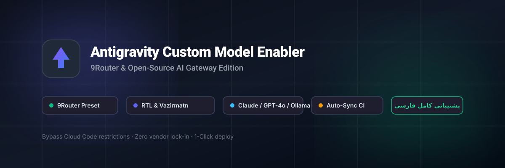

<p align="center">
  
</p>

<h1 align="center">راهنمای جامع فارسی Antigravity Custom Model Enabler</h1>

<p align="center">
  <strong>آموزش گام‌به‌گام اتصال ۹Router، Claude، OpenAI، DeepSeek و مدل‌های دلخواه به برنامه دسکتاپ Google Antigravity در تمام سیستم‌عامل‌ها</strong>
</p>

<p align="center">
  <a href="README.en.md"><strong>🌐 English Documentation</strong></a> ·
  <a href="#مرحله-۱-دستور-نصب-در-سیستم‌عامل‌های-مختلف">دستور نصب سیستم‌عامل‌ها</a> ·
  <a href="#مرحله-۲-افزودن-پرووایدر-۹router">افزودن ۹Router</a> ·
  <a href="#مرحله-۳-تست-اتصال-و-لود-خودکار-مدل‌ها">تست اتصال و Fetch مدل‌ها</a> ·
  <a href="#مرحله-۴-استفاده-در-چت-antigravity">استفاده در چت</a> ·
  <a href="#نحوه-پاک-کردن-تغییرات-و-بازگشت-به-حالت-اولیه-rollback">حذف و بازگشت (Rollback)</a>
</p>

---

## اسکریپت نصب چه کاری انجام می‌دهد؟

هنگام اجرای اسکریپت نصب، اقدامات زیر به صورت خودکار و امن انجام می‌گیرد:
1. **بررسی پیش‌نیازها:** بررسی نسخه Node.js (حداقل 22.13)، ابزار Git و وضعیت نصب بودن برنامه Antigravity.
2. **کامپایل پروژه:** بیلد ماژول‌های پچ و مترجم پروتکل ابری گوگل (`v1internal`).
3. **بستن ایمن Antigravity:** بستن پروسه برنامه پیش از تزریق فایل‌ها تا هیچ فایلی در حافظه رم سیستم قفل نماند.
4. **تزریق پچ و رابط کاربری:** فعال‌سازی قابلیت Custom Models، پشتیبانی از راست‌چین (RTL) و فونت وزیرمتن.
5. **راه‌اندازی مجدد برنامه:** باز کردن خودکار نرم‌افزار Antigravity.

---

## مرحله ۱: دستور نصب در سیستم‌عامل‌های مختلف

ابتدا مخزن را کلون کنید:
```bash
git clone https://github.com/ketabchi-ar/antigravity-add-model.git
cd antigravity-add-model
```

سپس با توجه به سیستم‌عامل خود، دستور زیر را اجرا کنید:

### ۱. سیستم‌عامل مک (macOS)
```bash
bash install.sh
```
*(یا می‌توانید مستقیماً از دستور `bash deploy.sh` استفاده کنید).*

### ۲. سیستم‌عامل ویندوز (Windows)
در محیط **PowerShell** دستور زیر را اجرا کنید:
```powershell
.\deploy.ps1
```

### ۳. سیستم‌عامل لینوکس (Linux)
```bash
bash install.sh
```
*(یا اجرای مستقیم `bash deploy_linux.sh`).*

---

## مرحله ۲: افزودن پرووایدر ۹Router

پس از باز شدن برنامه Antigravity:
1. وارد بخش تنظیمات شوید: **Settings → Models & Usage** (یا تب Models).
2. در بخش جدید **Custom Models**، روی دکمه **Add model** کلیک کنید.
3. در پنجره باز شده، از منوی **Provider** گزینه **9Router (Local AI Gateway)** را انتخاب کنید:
   * فیلد **API URL** خودکار با آدرس `http://127.0.0.1:20128/v1/chat/completions` پر می‌شود.
   * فیلد **API format** خودکار روی `OpenAI compatible` قرار می‌گیرد.
4. **کپی کردن API Key:**
   * مرورگر خود را باز کرده و به آدرس داشبورد ۹Router بروید: **`http://127.0.0.1:20128/dashboard/endpoint`**
   * کلید اختصاصی خود را کپی کرده و در فیلد **API key** داخل برنامه قرار دهید (Paste کنید).

<p align="center">
  
</p>

---

## مرحله ۳: تست اتصال و لود خودکار مدل‌ها (Fetch Models)

**نیازی به تایپ دستی نام یا شناسه تک‌تک مدل‌ها نیست!** مراحل زیر را طی کنید:

1. روی دکمه **Test connection** کلیک کنید:
   * با مشاهده پیام موفقیت (✅ Connection successful)، ارتباط آنتی‌گراویتی با ۹Router تأیید می‌شود.
2. بلافاصله روی دکمه **Fetch provider models** کلیک کنید:
   * برنامه مستقیماً با ۹Router ارتباط برقرار کرده و تمام مدل‌های فعال شما (نظیر `claude-3-5-sonnet`، `gpt-4o`، `deepseek-chat` و...) را در یک فهرست باز می‌کند.
3. مدل‌های مورد نیازتان را تیک بزنید.
4. در پایین فهرست، دکمه **Add selected** را کلیک کنید:
   * تمامی مدل‌های انتخاب‌شده به صورت هم‌زمان و با تنظیمات استاندارد توکن و کانتکست ذخیره می‌شوند.

<p align="center">
  
</p>

---

## مرحله ۴: استفاده در چت Antigravity

پس از افزودن مدل‌ها:
1. به صفحه چت اصلی Antigravity برگردید.
2. منوی کشویی انتخاب مدل در بالای پنجره گفتگو را باز کنید.
3. مدل‌های دریافت‌شده از ۹Router در دسته **Custom Models** ظاهر شده‌اند.
4. مدل مورد نظرتان را انتخاب کرده و از کدنویسی پرسرعت و بدون محدودیت لذت ببرید!

<p align="center">
  
</p>

---

## نحوه پاک کردن تغییرات و بازگشت به حالت اولیه (Rollback)

اسکریپت در اولین اجرا یک نسخه پشتیبان دست‌نخورده با هش معتبر از فایل اصلی برنامه تهیه کرده است. برای بازگشت ۱۰۰٪ به نسخه رسمی گوگل:

### گام ۱: بازگردانی فایل‌های اصلی کلاینت

* **در مک (macOS) و لینوکس (Linux):**
  ```bash
  cd antigravity-add-model
  node scripts/deploy.mjs --restore
  ```

* **در ویندوز (Windows PowerShell):**
  ```powershell
  cd antigravity-add-model
  node scripts/deploy.mjs --restore
  ```

### گام ۲: پاک کردن مدل‌های ذخیره‌شده (اختیاری)
* **در مک و لینوکس:**
  ```bash
  rm -f ~/.gemini/antigravity/custom_models.json
  ```
* **در ویندوز (PowerShell):**
  ```powershell
  Remove-Item "$env:USERPROFILE\.gemini\antigravity\custom_models.json" -Force
  ```

---

## رفع اشکالات متداول

### ۱. بعد از آپدیت رسمی Antigravity مدل‌ها ناپدید شدند!
با هر بار آپدیت خودکار برنامه توسط گوگل، کلاینت به حالت اول برمی‌گردد. کافیست مجدداً دستور نصب مربوط به سیستم‌عامل خود (`bash install.sh` در مک/لینوکس یا `.\deploy.ps1` در ویندوز) را اجرا کنید.

### ۲. چرا در بخش Fetch provider models هیچ مدلی لود نمی‌شود؟
* مطمئن شوید ۹Router روشن است و در داشبورد آن حداقل یک مدل به همراه ارائه‌دهنده مربوطه کانفیگ شده است.
* بررسی کنید که API Key وارد شده با کلید نمایش‌داده‌شده در آدرس `http://127.0.0.1:20128/dashboard/endpoint` مطابقت داشته باشد.

---

## لایسنس

پروژه تحت لایسنس [Apache License 2.0](LICENSE) منتشر شده است.
مخزن مرجع: [vahapogut/antigravity-add-model](https://github.com/vahapogut/antigravity-add-model)
